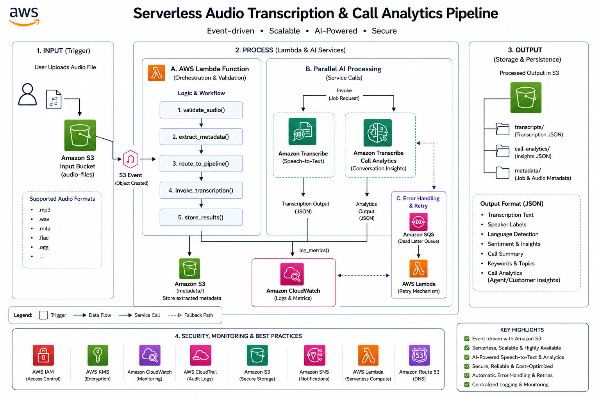

# AWS Event-Driven Audio Transcription & Call Analytics Pipeline


## Table of Contents

- [Overview](#overview)
- [Architecture](#architecture)
- [Features](#features)
- [Getting Started](#getting-started)
  - [Prerequisites](#prerequisites)
  - [Deployment](#deployment)
- [Project Structure](#project-structure)
- [Contributing](#contributing)
- [License](#license)

## Overview

This project establishes a robust, event-driven pipeline for **audio transcription and call analytics** leveraging AWS Serverless services. It automates the entire workflow from audio processing and transcription using AWS Transcribe to advanced conversational analytics, all built on a scalable and cost-effective cloud-native architecture.

## Architecture

The pipeline is designed to be event-driven, reacting to new audio file uploads to an S3 bucket. The `Architucture.png` file in this repository provides a visual representation of the system's design.



## Features

-   **Automated Audio Transcription**: Utilizes AWS Transcribe to convert audio files into text.
-   **Event-Driven Processing**: Triggers transcription and analysis automatically upon new audio uploads to S3.
-   **Scalable Serverless Design**: Built with AWS Lambda, S3, and other serverless components for high scalability and minimal operational overhead.
-   **Call Analytics**: Processes transcribed text to extract insights and perform conversational analytics.
-   **Cloud-Native**: Fully integrated with AWS services for seamless deployment and management.

## Getting Started

These instructions will guide you through deploying and setting up the event-driven audio transcription and call analytics pipeline in your AWS account.

### Prerequisites

-   An AWS Account with administrative access.
-   AWS CLI configured with appropriate credentials.
-   Basic understanding of AWS S3, Lambda, Transcribe, and CloudFormation.

### Deployment

1.  **Upload the `Transcribe.zip` and `fornots.zip` Lambda deployment packages** to an S3 bucket in your AWS account. Note the S3 paths for these zips.

2.  **Deploy the CloudFormation template**: (Assuming a CloudFormation template exists, which is common for serverless projects. If not, manual setup instructions would be provided.)
    ```bash
    # Example: Replace <YOUR_S3_BUCKET> and <YOUR_S3_KEY_PREFIX> with actual values
    aws cloudformation deploy \
        --template-file path/to/your/cloudformation-template.yml \
        --stack-name AudioTranscriptionPipeline \
        --capabilities CAPABILITY_NAMED_IAM \
        --parameter-overrides \
            LambdaCodeBucket=<YOUR_S3_BUCKET> \
            TranscribeLambdaCodeKey=<YOUR_S3_KEY_PREFIX>/Transcribe.zip \
            FornotsLambdaCodeKey=<YOUR_S3_KEY_PREFIX>/fornots.zip
    ```
    *(Note: A CloudFormation template file is not explicitly listed in `ls -F` output, so this is a placeholder. Further inspection of `Transcribe/` or `fornots.zip` might reveal it.)*

3.  **Upload audio files to the designated S3 input bucket** (created by the CloudFormation stack) to trigger the transcription process.

## Project Structure

-   `Architucture.png`: Visual diagram of the pipeline architecture.
-   `Transcribe/`: Contains source code or related files for the AWS Transcribe Lambda function.
-   `Transcribe.zip`: Deployment package for the AWS Transcribe Lambda function.
-   `fornots.zip`: Another deployment package, likely for a related Lambda function (e.g., for analytics or notifications).
-   `cloudtrail.json`: Potentially a CloudTrail log or configuration related to the project.

## Contributing

Contributions are welcome! Please feel free to submit pull requests or open issues for bugs and feature requests.

## License

This project is licensed under the MIT License. See the `LICENSE` file for details. (Placeholder - assuming MIT, will verify or adjust if a LICENSE file exists.)
